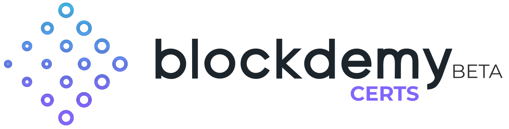

<p align="center"></p>

<h1 align="center"> Blockdemy Certs - Client </h1>

<p align="center"> A client to communicate within Blockdemy Certs API </p>

<hr/>

<p> <a href="https://certs.blockdemy.com">Blockdemy Certs</a> platform expose many endpoints through their API, in order to allow third party integrations to create Ethereum's blockchain backed document certifications. This client makes communcation and multipart file requests easy. </p>

<h3> List of features </h3>

<ul>
  <li>Get documents of your organization</li>
  <li>Get detailed info about certifications</li>
  <li>Upload documents to Ethereum's blockchain</li>
  <li>Explore owners public data</li>
</ul>

<h3> Get started </h3>

```javascript
const Certs = require('blockdemy-certs');

// Instantiate the certs client using your API Key from the platform
const certs = new Certs(APIKey);

// Use the methods available to get info for your organization
const myOrganizationDocuments = await cert.getDocuments();
```

<h3> Download & Installation </h3>

<h4>For npm</h4>

```shell
$ npm i blockdemy-certs
```

<h4>For yarn</h4>

```shell
$ yarn add blockdemy-certs
```

<h3>Contributing</h3>
Blockdemy Certs Client is open for contributions in order to make it easy to make our technology more open for the community.

<h3>Authors</h3>
<ul>
  <li>Ernesto García - Tech Leader @blockdemy</li>
</ul>

<h3>License</h3>

This project is licensed under the MIT License